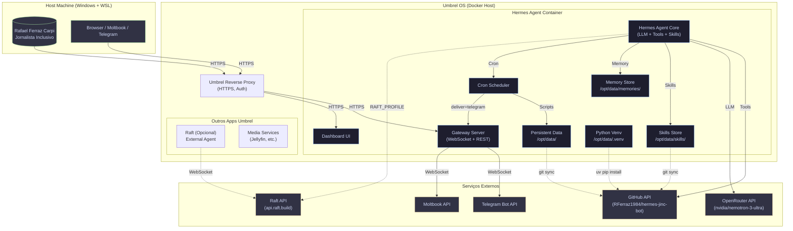

# Architecture Decision Records (ADR) — Hermes Agent for Jornalista Inclusivo (JINC Apps)

> Documento vivo. Atualize a cada decisão arquitetural significativa.
> Formato inspirado em [adr.github.io](https://adr.github.io/).

---

## Índice

1. [ADR-0001: Agente Hermes no Umbrel OS (Container Sandbox)](#adr-0001)
2. [ADR-0002: Autenticação GitHub via Classic PAT (ghp_)](#adr-0002)
3. [ADR-0003: Persistência em `/opt/data` + GitHub como Source of Truth](#adr-0003)
4. [ADR-0004: Skills como Memória Procedimental Versionada](#adr-0004)
5. [ADR-0005: Cron Jobs Locais (sem delivery TUI) + Gateway para Notificações](#adr-0005)
6. [ADR-0006: Acessibilidade como Requisito Não-Funcional Padrão](#adr-0006)
7. [ADR-0007: Integração Raft como External Agent (Opcional)](#adr-0007)

---

## ADR-0001: Agente Hermes no Umbrel OS (Container Sandbox) {#adr-0001}

**Status:** Aceito
**Data:** 2026-07-21

### Contexto
Hermes Agent roda como app Umbrel em container isolado. Filesystem host Windows não acessível (`/mnt/c` indisponível). Persistência apenas em `/opt/data`. Atualizações via Umbrel OS (não `hermes update`).

### Decisão
- Toda configuração, skills, cron, logs, sessões, memórias em `/opt/data` (Hermes home).
- `localhost` = container-local. Comunicação com outros apps Umbrel via Docker service names.
- Sem `sudo`, sem instalação de pacotes sistema. Python via `uv` + venv em `/opt/data/.venv`.
- Gateway + Dashboard sob s6, atrás do proxy Umbrel.

### Consequências
- Portabilidade limitada ao ecossistema Umbrel/Hermes.
- Isolamento forte (segurança), mas debug de rede requer `docker exec` ou logs do gateway.
- Dependências Python devem ser vendored ou instaladas no venv local.

---

## ADR-0002: Autenticação GitHub via Classic PAT (ghp_) {#adr-0002}

**Status:** Aceito
**Data:** 2026-07-21

### Contexto
Fine-grained PATs (`github_pat_`) não permitem criar repositórios na conta do usuário. Classic PATs (`ghp_`) com escopo `repo` permitem. Token armazenado em `/opt/data/.github-token` (chmod 600).

### Decisão
- Usar **Classic PAT** com escopos: `repo`, `workflow` (opcional), `read:org` (se orgs).
- Token no arquivo `/opt/data/.github-token` (não no git, não em env vars globais).
- Helper: `git config --global credential.helper store` para cache em `~/.git-credentials`.
- Para API: `curl -H "Authorization: token $(cat /opt/data/.github-token)"`.

### Consequências
- Token expira (padrão 90 dias) → rotina de renovação necessária.
- Risco se container comprometido → mitigação: token com escopo mínimo, expiração curta, rotação documentada.

---

## ADR-0003: Persistência em `/opt/data` + GitHub como Source of Truth {#adr-0003}

**Status:** Aceito
**Data:** 2026-07-21

### Contexto
Container efêmero fora de `/opt/data`. Precisamos de durabilidade para: skills, memórias, cron jobs, sessões, configuração. GitHub repo `RFerraz1984/hermes-jinc-bot` serve como backup versionado e colaborativo.

### Decisão
- **Runtime state** (logs, sessões, locks, cache) → `/opt/data` apenas.
- **Conhecimento durável** (skills, docs, ADRs, scripts, templates) → Git repo + sincronizado para `/opt/data/hermes-jinc-bot` (ou clonado lá).
- **Memórias Hermes** (user/memory stores) → `/opt/data/memories/` (não versionado, mas exportável).
- **Cron jobs** → definidos no Hermes (persistem em `/opt/data/cron/`), mas specs versionadas no repo.

### Consequências
- Fluxo: edit no repo → push → pull no container (ou cron job de sync).
- Conflitos resolvidos via git, não via merge manual de arquivos soltos.

---

## ADR-0004: Skills como Memória Procedimental Versionada {#adr-0004}

**Status:** Aceito
**Data:** 2026-07-21

### Contexto
Hermes carrega skills (markdown + scripts + templates) sob demanda. Skills vivem em `~/.hermes/skills/` (ou `/opt/data/skills/`). Precisam ser versionadas, revisadas, atualizadas quando pitfalls descobertos.

### Decisão
- Skills desenvolvidas no repo `hermes-jinc-bot/skills/<nome>/SKILL.md`.
- `skill_manage(action='create'|'patch'|'edit')` sincroniza para `/opt/data/skills/`.
- Cada skill tem: frontmatter YAML, passos numerados, seção "Pitfalls", verificação.
- Skills plugin-provided (ex: `github-auth`) têm prioridade; custom skills estendem/sobrescrevem.

### Consequências
- Ciclo: usar skill → encontrar gap → patch skill → commit → push → pull no container.
- Evita "conhecimento tribal" só na cabeça do agente ou do usuário.

---

## ADR-0005: Cron Jobs Locais + Gateway para Notificações {#adr-0005}

**Status:** Aceito
**Data:** 2026-07-21

### Contexto
Cron jobs no Hermes rodam em sessão isolada, sem contexto da TUI atual. `deliver='origin'` não entrega na TUI (sem canal live). Precisamos de notificações reais (Telegram, Discord, etc.) via Gateway.

### Decisão
- Jobs de monitoramento/alerta: `deliver='telegram'` (ou `all`) + `attach_to_session=true` se conversacional.
- Jobs fire-and-forget (backups, sync): `deliver='local'` (apenas log em `/opt/data/logs/cron/`).
- Scripts de cron em `/opt/data/scripts/` (versionados no repo).
- Health checks de jobs críticos via `notify_on_complete=true` + `watch_patterns` raro (rate limit 15s).

### Consequências
- Gateway Hermes deve estar saudável (logs em `/opt/data/logs/gateway.log`).
- Telegram bot token configurado no Hermes (`/opt/data/.env` ou config.yaml).

---

## ADR-0006: Acessibilidade como Requisito Não-Funcional Padrão {#adr-0006}

**Status:** Aceito
**Data:** 2026-07-21

### Contexto
Jornalista Inclusivo / Dataverso PcD produzem conteúdo para pessoas com deficiência. Agente deve modelar acessibilidade em tudo que cria.

### Decisão
- **Linguagem:** pessoa com deficiência (não "portador", "especial", "PcD" só como sigla após definição).
- **Estrutura:** headings semânticas, listas, tabelas acessíveis, alt text em imagens.
- **Código:** HTML semântico, ARIA quando necessário, contraste WCAG AA.
- **Ferramentas:** preferir libs que geram saída acessível (ex: `markdown-it` com plugins a11y).
- **Validação:** `axe-core` / `pa11y` em CI para artefatos web.

### Consequências
- Todo entregável (relatório, site, script, doc) passa por checklist de a11y.
- Skills de escrita (`humanizer`, `journalist-inclusion-research`) embutem diretrizes.

---

## ADR-0007: Integração Raft como External Agent (Opcional) {#adr-0007}

**Status:** Proposto (não ativado por padrão)
**Data:** 2026-07-21

### Contexto
Raft (raft.build) permite expor Hermes como agente externo via WebSocket. Útil para: multi-agente, UI própria, integração com outros sistemas.

### Decisão
- Credencial salva em `/opt/data/home/.slock/profiles/jornalista-inclusivo-bot/credential.json`.
- Adapter auto-ativa via `RAFT_PROFILE` em `/opt/data/.env`.
- Habilitar apenas quando houver caso de uso claro (ex: UI custom, orquestração multi-agente).
- Por padrão, Hermes standalone atende necessidades atuais.

### Consequências
- Complexidade operacional adicional (conexão persistente, reconexão, auth).
- Mantido desligado até demanda real.

---

## Diagrama de Arquitetura (Mermaid)

---

## Convenções de Atualização

| Evento | Ação |
|--------|------|
| Nova decisão arquitetural | Adicionar ADR nnnn ao final, atualizar índice |
| Mudança em ADR existente | Marcar status "Superado", linkar novo ADR |
| Diagrama desatualizado | Atualizar Mermaid + commit message "docs(arch): update diagram" |
| Skill nova afeta arquitetura | Referenciar skill no ADR relevante |

---

## Referências

- [Hermes Agent Docs](https://hermes-agent.nousresearch.com/docs)
- [Umbrel OS Docs](https://github.com/getumbrel/umbrel-os)
- [ADR GitHub](https://adr.github.io/)
- [WCAG 2.1 AA](https://www.w3.org/WAI/WCAG21/quickref/)
- [Raft External Agent](https://docs.raft.build/external-agents)