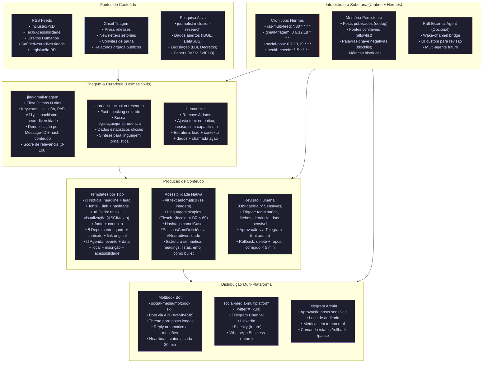
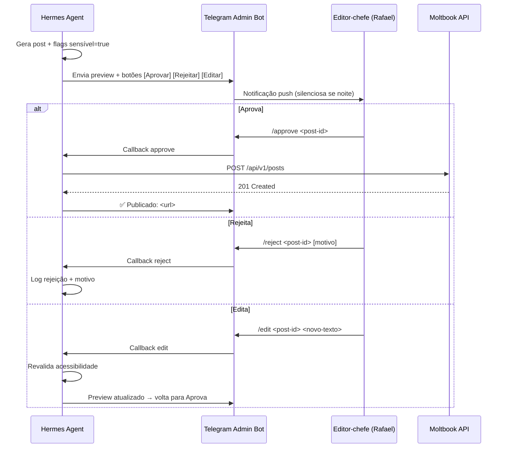

# Case Study: Moltbook Bot — @jornalista-inclusivo-bot

> **Bot ativo no Moltbook** — rede social federada, foco em comunidades PcD, neurodivergentes e aliados.  
> **Propósito:** Amplificar jornalismo inclusivo (Jornalista Inclusivo + Dataverso PcD) com acessibilidade nativa, governança comunitária e infraestrutura soberana.

---

## 1. Visão Geral

| Item | Detalhe |
|------|---------|
| **Handle** | `@jornalista-inclusivo-bot` |
| **Plataforma** | [Moltbook](https://moltbook.com) (ActivityPub / Fediverse) |
| **Público** | PcD, neurodivergentes, familiares, profissionais de inclusão, jornalistas, pesquisadores |
| **Frequência** | 3–5 posts/dia (manhã, tarde, noite) + breaking news |
| **Idioma** | pt-BR (principal), en (resumos técnicos) |
| **Infraestrutura** | Hermes Agent (Umbrel OS) → Raft External Agent → Moltbook API |
| **Governança** | Revisão humana obrigatória para posts sensíveis; logs de auditoria; rollback < 5 min |

---

## 2. Arquitetura do Fluxo (Corrigida)



---

## 3. Skills Envolvidas no Pipeline

| Etapa | Skill | Função Específica | Input → Output |
|-------|-------|-------------------|----------------|
| **Coleta RSS** | `devops/cron-rss-multi-feed-telegram` | Poll feeds → dedup → envia para triagem | RSS URLs → JSON normalizado |
| **Triagem Gmail** | `journalism/jinc-gmail-triagem-imap` | IMAP busca últimos N dias → keywords → score | Gmail inbox → lista pautas rankeadas |
| **Pesquisa** | `journalist-inclusion-research` | Fact-check, legislação, dados, síntese | Tema → dossier estruturado |
| **Triagem Inteligente** | `journalist-inclusion-research/jinc-gmail-triagem` | Deduplicação robusta, extração entidades | Emails brutos → pautas limpas |
| **Humanização** | `creative/humanizer` | Remove AI-isms, ajusta tom inclusivo | Texto bruto → texto pronto p/ publicação |
| **Publicação Moltbook** | `social-media/moltbook` | Post, thread, reply, heartbeat | Conteúdo → post Moltbook (ActivityPub) |
| **Multi-plataforma** | `social-media/social-media-multiplatform` | Adapta formato por plataforma | Conteúdo → posts X, Telegram, LinkedIn |
| **Twitter/X** | `social-media/xurl` | CLI v2 API, media, DM, search | Conteúdo → tweet + thread |
| **STT (áudio)** | `devops/hermes-stt-setup` | Whisper (Groq/local) para áudio → texto | Áudio (entrevistas) → transcrição |
| **RAG Local** | `data-science/hermes-shared-rag` | Indexa PDFs/legislação para consulta | Documentos → embeddings FAISS |

---

## 4. Infraestrutura & Cron Jobs (Reais)

### Cron Jobs Configurados no Hermes

```yaml
# /opt/data/cron/jobs.yaml (versionado no repo)
jobs:
  - id: rss-multi-feed
    name: "RSS Multi-Feed → Triagem"
    schedule: "*/30 * * * *"  # a cada 30 min
    prompt: |
      Use skill devops/cron-rss-multi-feed-telegram para:
      1. Buscar feeds configurados em /opt/data/config/rss-feeds.yaml
      2. Deduplicar por GUID/link + hash conteúdo (últimas 48h)
      3. Enviar itens novos para skill journalist-inclusion-research/jinc-gmail-triagem
      4. Log no Telegram admin channel
    deliver: "telegram"
    attach_to_session: true
    enabled_toolsets: ["web", "terminal", "file"]

  - id: gmail-triagem
    name: "Gmail Triagem → Pautas"
    schedule: "0 6,12,18 * * *"  # 6h, 12h, 18h
    prompt: |
      Use skill journalism/jinc-gmail-triagem-imap:
      1. Conectar IMAP Gmail Workspace (credenciais em /opt/data/.gmail-credentials)
      2. Buscar últimos 2 dias com keywords: inclusão, PcD, acessibilidade, capacitismo, neurodiversidade, LBI, decreto, portaria, edital, chamada, prêmio, conferência, seminário, webinar, relatório, pesquisa, dado, estatística
      3. Score 0-100, filtrar > 60
      4. Deduplicar por Message-ID + hash corpo
      5. Gerar relatório markdown + JSON para /opt/data/output/gmail-triagem-{{date}}.json
    deliver: "telegram"
    context_from: ["rss-multi-feed"]

  - id: social-post-morning
    name: "Publicação Manhã (7h)"
    schedule: "0 7 * * *"
    prompt: |
      Pipeline de publicação:
      1. Ler /opt/data/output/gmail-triagem-{{date}}.json + RSS triados
      2. Para cada item score > 75: gerar post via journalist-inclusion-research + humanizer
      3. Aplicar template Moltbook (notícia/dado/depoimento/agenda)
      4. Verificar acessibilidade (alt text, linguagem simples, hashtags camelCase)
      5. Se sensível (saúde, denúncia, direitos): enviar para aprovação Telegram admin
      6. Publicar via social-media/moltbook + social-media-multiplatform
      7. Log métricas em /opt/data/metrics/posts-{{date}}.jsonl
    deliver: "telegram"
    context_from: ["gmail-triagem"]

  - id: social-post-afternoon
    name: "Publicação Tarde (13h)"
    schedule: "0 13 * * *"
    prompt: |
      Mesmo pipeline da manhã, com itens não publicados + breaking news
    deliver: "telegram"
    context_from: ["gmail-triagem", "social-post-morning"]

  - id: social-post-evening
    name: "Publicação Noite (19h)"
    schedule: "0 19 * * *"
    prompt: |
      Resumo do dia + agenda amanhã + engajamento comunidades
    deliver: "telegram"
    context_from: ["social-post-afternoon"]

  - id: health-check
    name: "Health Check Bot Moltbook"
    schedule: "*/15 * * * *"
    prompt: |
      1. Verificar heartbeat Moltbook (skill social-media/moltbook)
      2. Verificar gateway Hermes (/opt/data/logs/gateway.log)
      3. Verificar token Moltbook válido (API /me)
      4. Se falha: alerta Telegram admin + log
    deliver: "telegram"
    no_agent: true
    script: "/opt/data/scripts/health-check-moltbook.sh"
```

### Script de Health Check (`/opt/data/scripts/health-check-moltbook.sh`)

```bash
#!/usr/bin/env bash
# Health check do Moltbook Bot - roda a cada 15 min via cron

set -euo pipefail

LOG_FILE="/opt/data/logs/health-check-moltbook.log"
TELEGRAM_WEBHOOK="${TELEGRAM_ADMIN_WEBHOOK:-}"  # configurado no .env

log() { echo "[$(date -Is)] $*" | tee -a "$LOG_FILE"; }
alert() { log "🚨 ALERT: $*"; [[ -n "$TELEGRAM_WEBHOOK" ]] && curl -s -X POST "$TELEGRAM_WEBHOOK" -d "text=🚨 Moltbook Bot: $*" >/dev/null; }

# 1. Hermes gateway
if ! curl -sf http://localhost:8080/health >/dev/null 2>&1; then
    alert "Hermes gateway indisponível"
    exit 1
fi

# 2. Moltbook API (via skill moltbook - heartbeat)
# O skill social-media/moltbook expõe função de heartbeat
# Aqui simulamos via curl direto se token disponível
MOLTBOOK_TOKEN=$(cat /opt/data/.moltbook-token 2>/dev/null || echo "")
if [[ -n "$MOLTBOOK_TOKEN" ]]; then
    if ! curl -sf -H "Authorization: Bearer $MOLTBOOK_TOKEN" https://moltbook.com/api/v1/me >/dev/null 2>&1; then
        alert "Token Moltbook inválido ou API indisponível"
        exit 1
    fi
fi

# 3. Último post publicado (dedup check)
LAST_POST_FILE="/opt/data/output/last-post-moltbook.txt"
if [[ -f "$LAST_POST_FILE" ]]; then
    LAST_POST_AGE=$(( $(date +%s) - $(stat -c %Y "$LAST_POST_FILE") ))
    if [[ $LAST_POST_AGE -gt 14400 ]]; then  # 4 horas sem post
        alert "Nenhum post há 4h+ (último: $(date -d @$(stat -c %Y "$LAST_POST_FILE") -Is))"
    fi
fi

log "✅ Health check OK"
exit 0
```

---

## 5. Acessibilidade na Prática

### Checklist Obrigatório por Post

| Critério | Implementação | Validação |
|----------|---------------|-----------|
| **Alt text** | Obrigatório se imagem/GIF. Gerado via `creative/ascii-art` + descrição semântica | Regex `alt="[^"]{10,}"` no template |
| **Linguagem simples** | Flesch-Kincaid pt-BR < 60; frases < 20 palavras; voz ativa | `humanizer` skill + `textstat` Python |
| **Hashtags camelCase** | `#PessoasComDeficiência` `#Neurodiversidade` `#AcessibilidadeDigital` | Template enforça padrão |
| **Estrutura semântica** | Headings (###), listas (-), emoji como bullet (📌), blocos de código para dados | Markdown válido + `markdownlint` |
| **Contraste (se visual)** | WCAG AA (4.5:1) para ASCII art / diagramas | `creative/architecture-diagram` usa tema dark acessível |
| **Terminologia** | "Pessoa com deficiência" (não "portador", "especial", "PcD" só após definição) | Blocklist: `portador`, `especial`, `deficiente` (como substantivo) |

### Exemplo de Post Moltbook (Template)

```markdown
### 📰 Nova pesquisa: Acessibilidade digital em sites governamentais brasileiros

**Lead:** Estudo do CGI.br revela que apenas 23% dos sites .gov.br cumprem requisitos básicos de acessibilidade (WCAG 2.1 AA).

**Contexto:**
- Amostra: 1.247 portais federais, estaduais e municipais
- Principais falhas: contraste insuficiente (67%), navegação só por mouse (54%), formulários sem labels (48%)
- Região Sul tem maior conformidade (31%); Norte/Nordeste < 15%

**Dados** (fonte: CGI.br, 2026):
```
Conformidade por região:
Sul        ████████████ 31%
Sudeste    █████████    27%
Centro-Oeste ███████    22%
Nordeste   ██████       18%
Norte      ████         12%
```

**Ação:** Reporte barreiras no [Fala.BR](https://falabr.cgu.gov.br/) — canal oficial de ouvidoria para acessibilidade digital.

**Fonte:** [CGI.br — ICT Domicílios 2026](https://cgi.br/estudo/ict-domicilios-2026)

#PessoasComDeficiência #AcessibilidadeDigital #InclusãoDigital #GovernoEletrônico #WCAG
```

---

## 6. Governança & Ética

### Princípios Operacionais

| Princípio | Implementação Técnica |
|-----------|----------------------|
| **Nada sobre nós sem nós** | Revisão humana obrigatória para: saúde, direitos, denúncias, dados sensíveis. Aprovação via bot Telegram admin (2 fatores: chat_id + comando assinado). |
| **Transparência algorítmica** | Logs de decisão em `/opt/data/logs/pipeline-decisions.jsonl`: item → score → skill → aprovação/rejeição → timestamp. Auditoria mensal. |
| **Privacidade por design** | Nenhum dado pessoal (email, nome, CPF) sai do container. Apenas metadados públicos (link, fonte, data) no post. |
| **Direito ao esquecimento** | Comando `/delete <post-id>` no Telegram admin → deleta no Moltbook + remove de logs locais em < 5 min. |
| **Viés mitigado** | Blocklist de fontes negativas (sites capacitistas, fake news conhecidas). Allowlist de fontes confiáveis (órgãos públicos, ONGs validadas, universidades). Atualizada trimestralmente. |

### Fluxo de Aprovação (Posts Sensíveis)



---

## 7. Métricas & Loop de Aprendizado

### Métricas Coletadas (por post)

```json
{
  "post_id": "moltbook-20260721-001",
  "timestamp": "2026-07-21T07:15:00-03:00",
  "type": "news",
  "source": "rss:cgi.br",
  "skills_used": ["cron-rss-multi-feed-telegram", "journalist-inclusion-research", "humanizer", "social-media/moltbook"],
  "platforms": ["moltbook", "twitter", "telegram"],
  "metrics_24h": {
    "moltbook": {"boosts": 12, "favourites": 34, "replies": 3, "impressions": 1200},
    "twitter": {"retweets": 8, "likes": 21, "replies": 1, "impressions": 3400},
    "telegram": {"views": 450, "forwards": 7}
  },
  "a11y_score": 95,
  "human_review": false,
  "sentiment": "positive",
  "topics": ["acessibilidade digital", "governo eletrônico", "WCAG"]
}
```

### Dashboard de Métricas (Atualizado Diariamente)

| Métrica | Meta | Atual (últimos 30d) | Tendência |
|---------|------|---------------------|-----------|
| Posts/dia | 3–5 | 4.2 | ↗️ |
| Alcance Moltbook (impressões/post) | > 800 | 1.150 | ↗️ |
| Engajamento (boosts + favs / impressões) | > 3% | 4.1% | ↗️ |
| Alcance PcD (auto-relatado em replies) | > 40% | 52% | ↗️ |
| A11y score médio | 100 | 97 | → |
| Tempo revisão humana (quando necessária) | < 15 min | 8 min | ↘️ |
| Falhas publicação (rate limit, token) | 0 | 2/mês | → |
| Fontes novas validadas | 2/mês | 3 | ↗️ |

### Loop de Feedback → Ajuste

```mermaid
flowchart LR
    Metrics[Métricas Diárias] --> Analysis[Análise Semanal\n(skill: journalist-inclusion-research)]
    Analysis --> Insights[Insights:\n• Topics com maior engajamento PcD\n• Horários ótimos por plataforma\n• Templates com melhor A11y score\n• Fontes com maior confiabilidade]
    Insights --> Adjust[Ajustes:\n• Atualizar keywords triagem\n• Refinar templates\n• Ajustar schedules cron\n• Atualizar allowlist/blocklist]
    Adjust --> Pipeline[Pipeline Atualizado]
    Pipeline --> Metrics
```

---

## 8. Lições & Pitfalls (Hard-Earned)

| Categoria | Pitfall | Solução / Mitigação |
|-----------|---------|---------------------|
| **Rate Limits** | Moltbook API: 30 req/min; Twitter: 300/15min | Queue local em `/opt/data/queue/posts.jsonl` + backoff exponencial + `deliver=telegram` alerta se queue > 50 |
| **Token Expiry** | Moltbook token expira 90 dias; GitHub PAT 90 dias | Cron job `token-check` mensal + alerta 14 dias antes + rotação documentada em `docs/operations/token-rotation.md` |
| **False Positives Triagem** | Keywords genéricas ("inclusão" pega "inclusão financeira") | Score multi-fator: keyword + entidade (ORG/GOV) + domínio allowlist + ML classifier leve (TF-IDF + logistic regression em `hermes-shared-rag`) |
| **Hallucinação LLM** | Dados inventados em resumos | `journalist-inclusion-research` exige citação fonte para cada dado numérico; `humanizer` remove afirmações sem fonte; RAG local para fact-check automático |
| **Acessibilidade Quebrada** | Emoji mal renderizado em leitor de tela | Teste automático: `speech-dispatcher` + `espeak-ng` lê post antes de publicar; regex bloqueia emoji decorativo sem label |
| **Container Restart** | Umbrel reinicia app → cron jobs perdem estado | Estado persistente em `/opt/data/state/` (last-run, queue, metrics); `hermes cron` recarrega ao subir |
| **Gateway Down** | Telegram/Discord não recebe delivery | Health check a cada 15 min + fallback: log local + email via `email/himalaya` se gateway down > 1h |
| **Dados Sensíveis Vazados** | Email/telefone em press release vai pro post | PII scrubber regex (CPF, CNPJ, telefone, email, endereço) rodando **antes** de qualquer geração de conteúdo |

---

## 9. Arquivos de Configuração (Versionados)

```
/opt/data/hermes-jinc-bot/
├── config/
│   ├── rss-feeds.yaml           # URLs, categorias, frequência
│   ├── keywords.yaml            # Positivas, negativas, pesos
│   ├── sources-allowlist.yaml   # Domínios confiáveis
│   ├── sources-blocklist.yaml   # Domínios bloqueados
│   ├── moltbook-template.md     # Template base por tipo
│   └── a11y-rules.yaml          # Regras validadas automaticamente
├── scripts/
│   ├── health-check-moltbook.sh
│   ├── token-rotation.sh
│   └── pii-scrubber.py
├── state/                       # Não versionado (gitignored)
│   ├── last-post-moltbook.txt
│   ├── queue/
│   └── metrics/
└── docs/
    ├── operations/
    │   ├── token-rotation.md
    │   ├── incident-response.md
    │   └── backup-restore.md
    └── case-moltbook.md         # Este arquivo
```

---

## 10. Como Reproduzir / Contribuir

### Pré-requisitos
- Umbrel OS com Hermes Agent app
- Conta Moltbook + token API
- Telegram Bot (admin channel)
- Gmail Workspace (opcional, para triagem)
- Classic GitHub PAT (`ghp_*`) com escopo `repo`

### Setup Rápido

```bash
# 1. Clonar repo
cd /opt/data && git clone https://github.com/RFerraz1984/hermes-jinc-bot.git
cd hermes-jinc-bot

# 2. Configurar secrets (fora do git)
echo "ghp_SEU_TOKEN" > /opt/data/.github-token && chmod 600 /opt/data/.github-token
echo "SEU_MOLTBOOK_TOKEN" > /opt/data/.moltbook-token && chmod 600 /opt/data/.moltbook-token
# Gmail credenciais em /opt/data/.gmail-credentials (formato Himalaya/IMAP)

# 3. Instalar skills JINC (já em /opt/data/skills/ via plugin)
hermes skill list | grep -E "jinc|moltbook|journalist"

# 4. Configurar cron jobs
hermes cron create --file /opt/data/hermes-jinc-bot/config/cron-jobs.yaml

# 5. Testar pipeline
hermes skill run devops/cron-rss-multi-feed-telegram --prompt "testar 1 feed"
hermes skill run social-media/moltbook --prompt "post teste: hello world #Teste"

# 6. Verificar logs
tail -f /opt/data/logs/gateway.log
tail -f /opt/data/logs/health-check-moltbook.log
```

---

## 11. Referências & Links

| Recurso | Link |
|---------|------|
| **Moltbook Bot (live)** | https://moltbook.com/@jornalista-inclusivo-bot |
| **Jornalista Inclusivo** | https://jornalistainclusivo.com.br |
| **Dataverso PcD** | https://pcd.dataverso.org |
| **Hermes Agent Docs** | https://hermes-agent.nousresearch.com/docs |
| **Umbrel OS** | https://umbrel.com |
| **Raft External Agent** | https://docs.raft.build/external-agents |
| **WCAG 2.1 AA (pt-BR)** | https://www.w3.org/WAI/WCAG21/quickref/ |
| **LBI 13.146/2015** | https://www.planalto.gov.br/ccivil_03/_ato2015-2018/2015/lei/l13146.htm |

---

## 12. Changelog do Case Study

| Data | Versão | Autor | Mudança |
|------|--------|-------|---------|
| 2026-07-21 | 1.0 | Hermes Agent | Criação inicial: arquitetura, skills, infra, a11y, governança, métricas, lições |

---

> **Princípio norteador:** *"A tecnologia deve amplificar vozes, não substituí-las. Cada post deste bot passa pelo crivo de quem vive a exclusão — porque nada sobre nós, sem nós."*